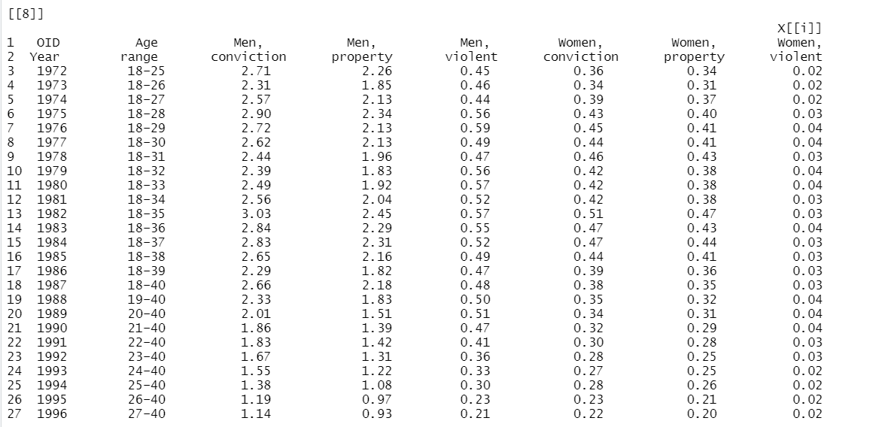

# Summary

**pdftabextract** is an R package[@R] that facilitates the extraction of tables from PDF files. The package extends the text extraction capacity of pdftools[@pdftools] to allow for the extraction of tables from a specific page of a PDF file or extract all tables in a PDF. By utilizing the functionality of pdftools, tables can be easily extracted from PDF files in R environment without the need for additional setup. Users can directly extract rectangular tables in a PDF file and save the output as an R dataframe, while unconventional tables can be saved as a list. This has the potential to improve the data extraction process for meta-analysis projects and secondary data analysis from published documents. Detailed usage instruction is available [online](https://github.com/Mubarak-M/pdftableExtractor/edit/main/README.md)

# Statement of need

The multi-dimensional property of PDF files, which include its ability to incorporate a variety of content types- text, images, hyperlinks, vector graphics etc. into a single file, as well as the ability to display such file across different devices, operating systems and application software makes it a popular format for journal articles, reports, proposals, etc. However, its layout-oriented structure, which prioritizes human reading, makes further machine processing challenging [@khusro_methods_2015].

Tables are also one of the most commonly used formats for presenting and structuring data. They are helpful for displaying complex data and explaining statistical information. Although, humans can identify tables, the lack of common characteristics makes it difficult for computer to recognize, especially when embedded within a PDF file. Various delimiters are employed across table formats, from the use of graphical boundary lines to indicate row and cell boundaries, to creating table view with white spaces. They can also differ in terms of whether or not they have spanning rows and/or columns.

Table extraction from PDF files has received considerable attention within the R community. Packages such as Tabulizer [@leeper2018tabulizer], PDE [@stricker_pdf_2021] and [pdftables](pdftables.com) offer the opportunity to extract tables within a PDF file. However, the complexity of table extraction task from PDF files makes it difficult for a single package to meet all the needs in this area. For example, Tabulizer[@leeper2018tabulizer] requires additional JAVA library which might not be accessible to users with low computing resources, PDE [@stricker_pdf_2021] requires additional processing of data while [pdftables](pdftables.com) is available through a paid subscription.

The pdftabextract package addresses some of these limitations by making pdf table extraction task available for free within R environment while requiring very minimal computing resources. This ensures accessibility by users working within resource constrained environments. The workflow of the package is completely script-based, thereby offering users the opportunity of producing outputs that are reproducible.

This package has tremendous use case in research synthesis where the process of extracting data from primary studies for the purpose of meta analysis methods [@cooper_handbook_2019] is usually time consuming. Key statistical and study information needed for coding of effect size information are usually presented in tables, pdftabextract therefore has the potential to the process of extracting such data more efficient and reproducible. 


# Minimal Example


## Installation
The development version of `pdftableExtractor` can be downloaded using devtools:

```{r install, eval = FALSE}
install.packages("devtools")
devtools::install_github('Mubarak-M/pdftableExtractor')
```


### `extractor_tables`
This is a basic example which shows you how to extract tables from a pdf document
using `extractor_tables` function:

```{r extractor_tables, eval=FALSE}
library(pdftableExtractor)
file <- system.file("extdata", "onecoldata.pdf", package = "pdftableExtractor")
table1 <- extractor_tables(file, path = TRUE)
```

All tables in `onecoldata.pdf` [@machin_crime_2011] are stored as a list containing 11 data frames 
in table1.
Example of one of the data frames is presented below:




# Limitations

- **Over selection:** 
Given the dynamic format of tables and the complexity of pdf documents, the table extraction algorithms can over select text as table in some circumstances.

- **Table inserted as image:** 
Table inserted as image in pdf document cannot be extracted, the package uses the [pdftools](https://github.com/ropensci/pdftools) package and is currently only capable of reading text.

# Acknowledgements


# References
