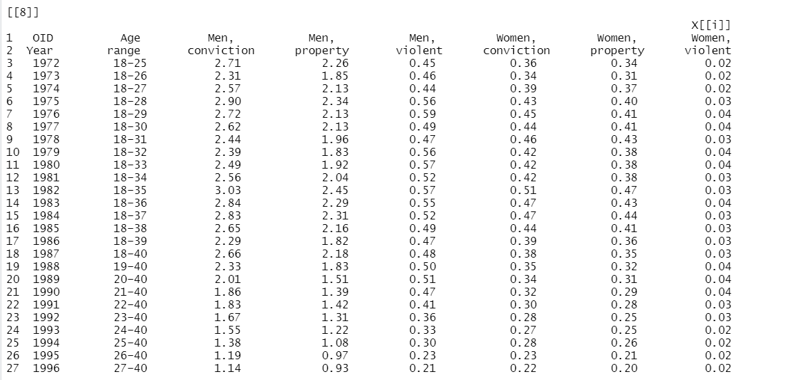
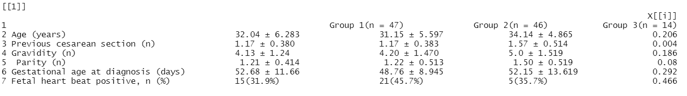
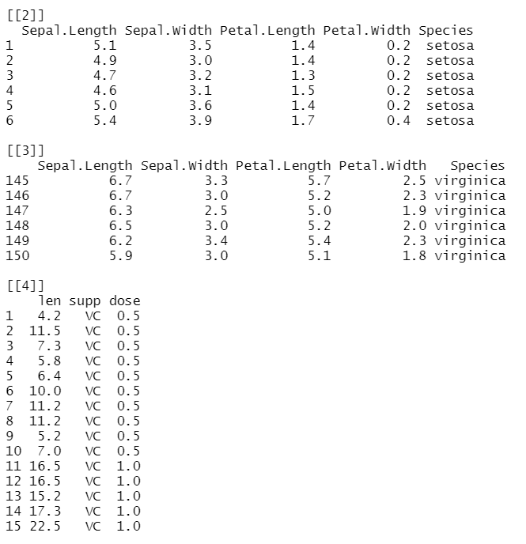

```{r, include = FALSE}
knitr::opts_chunk$set(
  collapse = TRUE,
  comment = "#>",
  fig.path = "man/figures/README-",
  out.width = "100%"
)
```

# pdftableExtractor

<!-- badges: start -->
<!-- badges: end -->

The `pdftableExtractor` package provides functions for extracting tables from PDF
 files. Using the [pdftools](https://github.com/ropensci/pdftools)  package developed by [rOpenSci](https://ropensci.org/), tables can be easily extracted from pdf files in R 
 environment without the need for additional setup. 
 
 
## Installation
The development version of `pdftableExtractor` can be downloaded using devtools:

```{r install, eval = FALSE}
install.packages("devtools")
devtools::install_github('Mubarak-M/pdftableExtractor')
```

## Usage
`pdftableExtractor` provides functions to extract tables from single and
double column PDF files. It has additional functionality which allows users to
extract tables from specific page(s) in pdf files. The `exctractor_tables` function
extract tables from single column pdf file and the `pages_tables` helper function
does the same for specified page(s) in the pdf file. The `exctractor_tables2` and 
`pages_tables`functions extract tables from uploaded pdf file and specified pages
respectively, but with double column pdf files.

## Usage guide for single column document
### `extractor_tables`
This is a basic example which shows you how to extract tables from single
column pdf documents using `extractor_tables` function:

```{r extractor_tables, eval=FALSE}
library(pdftableExtractor)
file <- system.file("extdata", "onecoldata.pdf", package = "pdftableExtractor")
table1 <- extractor_tables(file, path = TRUE)
```

All tables in `onecoldata.pdf` are stored as a list containing 11 data frames 
in table1.
Example of one of the data frames is presented below:


```{r, out.width = "70%", fig.align = "center", echo = FALSE}

```

### `pages_tables`
This is a basic example which shows you how to extract tables from a specific 
page(s) of a single column pdf documents using `pages_tables` function:

```{r pages_tables}
library(pdftableExtractor)
file <- system.file("extdata", "onecoldata.pdf", package = "pdftableExtractor")
table2 <- pages_tables(file,pages = 19, path = TRUE)
table2
```

#### Rectangular data
Extracting a rectangular data that is ready for analysis in R can 
reduce data processing time. The `rec` argument is capable of extracting clean
data.frame from pdf files. For this argument to work, users must be sure that the
table meets the requirement of a rectangular data. That is, all rows 
and all columns must be of equal length.

```{r singlecol}
library(pdftableExtractor)
file <- system.file("extdata", "onecoldata.pdf", package = "pdftableExtractor")
table3 <- pages_tables(file, pages = 18, path = TRUE, rec = TRUE)
table3
```

## Usage guide for double column document
### `extractor_tables2`
This is a basic example which shows you how to extract tables from double column
pdf documents using `extractor_tables2` function:

```{r extractor_tables2, eval=FALSE}
library(pdftableExtractor)
file <- system.file("extdata", "twocoldata.pdf", package = "pdftableExtractor")
table4 <- extractor_tables2(file, path = TRUE)
```

All tables in `twocoldata.pdf` are stored as a list containing 4 data frames 
in table4.

Example of one of the data frames is presented below:


```{r, out.width = "80%", fig.align = "center", echo = FALSE}

```

### `pages_tables2`
This is a basic example which shows you how to extract tables from a specific 
page(s) of a double column pdf documents using `pages_tables2` function:

```{r pages_tables2}
library(pdftableExtractor)
file <- system.file("extdata", "twocoldata.pdf", package = "pdftableExtractor")
table5 <- pages_tables2(file,pages = 3, path = TRUE)
table5
```
## Additional guide for extracting rectangular data from pdf
### `extractor_tables`
This is a basic example which shows you how to extract tables pdf document with
rectangular data using `extractor_tables` function and the `rec` argument:

```{r recdata, eval=FALSE}
library(pdftableExtractor)
file <- system.file("extdata", "recdata.pdf", package = "pdftableExtractor")
table <- extractor_tables(file, path = TRUE, rec = TRUE)
```


```{r, out.width = "70%", fig.align = "center", echo = FALSE}

```


## Limitations

### Over selection
Given the dynamic format of tables and the complexity of pdf documents, the table 
extraction algorithms can over select text as table in some circumstances.
However, these texts can be drop through additional processing of the output data.

Specifically, when working with double column pdf files where table does not cut 
across both columns, texts on the other column are greedily extracted as being part
of the table.

### Table inserted as image
Table inserted as image in pdf document cannot be extracted, the package uses the [pdftools](https://github.com/ropensci/pdftools) package and is currently only 
capable of reading text.


